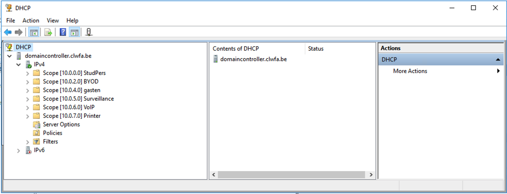
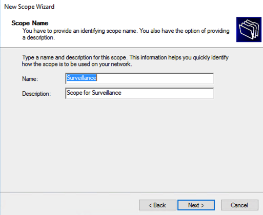
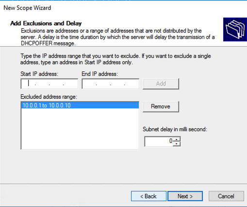

# Domain Controller

TODO

* [ ] DOMAIN CONTROLLER
  * [x] USERS AANMAKEN
  * [x] 7 SITES AANMAKEN \(subnetten\)
  * [x] 7 SITES DCHP
  * [x] ACTIVE DIRECTORY
  * [x] DNS
  * [x] Mac reservatie voor camera
  * [ ]  DHCP Testen op verschillende van Vlans 
* [x] FP SERVER
  * [x] LID VAN DOMAIN
  * [ ] PRINT SERVER
  * [ ] FILE SERVER
* [x] CLIENT
  * [x] INSTALL WINDOWSE
  * [ ] LID VAN DOMAIN

## Booten van DELL SERVER

## DHCP

## 

### Opzetten nieuwe scope

#### DNS Server and domain name

#### DHCP RAnge

#### Ip Adressen range die niet geen DHCP mogen krijgen

