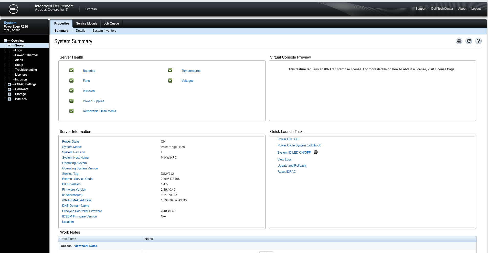

# Domain Controller

TODO

* [ ] DOMAIN CONTROLLER
  * [x] USERS AANMAKEN
    * [x] Personeel
    * [x] Admin
    * [x] Studenten
  * [x] 7 SITES AANMAKEN \(subnetten\)
  * [x] 7 SITES DCHP
  * [x] ACTIVE DIRECTORY
  * [x] DNS
  * [ ] Mac reservatie
    * [x] Camera
    * [ ] Telefoon
  * [ ]  TESTEN DHCP
  * [x] OU
    * [x] OU Studenten
    * [x] OU Personeel
  * [ ] Groups

    * [ ] Groups studenten
    * [ ] groups personeel
* [x] FP SERVER
  * [x] LID VAN DOMAIN
  * [ ] PRINT SERVER
    * [ ] Printer geinstalleerd
    * [ ] Koppeling aan pc
  * [ ] FILE SERVER
    * [x] Shared Folders
    * [ ] 
* [x] CLIENT
  * [x] INSTALL WINDOWSE
  * [ ] LID VAN DOMAIN

## Booten van DELL SERVER

